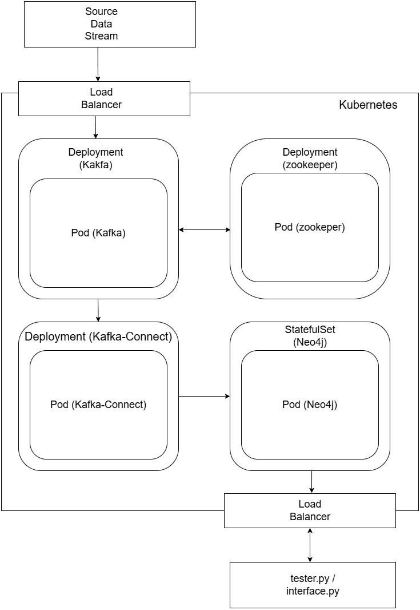

# A Kubernetes-Orchestrated Kafka–Neo4j Pipeline for Real-Time Graph Analytics 

## Overview

This project implements a scalable and highly available data processing pipeline using Kubernetes, Kafka, and Neo4j. The pipeline ingests a stream of data (NYC Yellow Cab dataset) and performs near-real-time graph analytics, including PageRank and Breadth-First Search (BFS).

---

## Project Structure

```
.
├── Dockerfile
├── init.sh
├── kafka-neo4j-connector.yaml
├── kafka-setup.yaml
├── neo4j-service.yaml
├── neo4j-values.yaml
├── zookeeper-setup.yaml
├── sink.neo4j.json
├── interface.py
├── data_producer.py
├── grader.md
└── README.md
```

---

## Components

### 1. Kubernetes Setup
- **Minikube** as Kubernetes orchestrator
- **Kafka** (using Zookeeper)
- **Neo4j** with Graph Data Science plugin
- **Kafka Connect** for Neo4j integration

### 2. Data Source
- NYC Yellow Cab March 2022 dataset

### 3. Key Technologies
- Docker
- Kubernetes
- Apache Kafka
- Neo4j (Graph Data Science)

---

## Setup and Deployment

### Step 1: Deploy Zookeeper and Kafka
```bash
kubectl apply -f zookeeper-setup.yaml
kubectl apply -f kafka-setup.yaml
```

### Step 2: Deploy Neo4j
```bash
helm install my-neo4j-release neo4j/neo4j -f neo4j-values.yaml
kubectl apply -f neo4j-service.yaml
```

### Step 3: Deploy Kafka-Neo4j Connector
```bash
kubectl apply -f kafka-neo4j-connector.yaml
```

### Step 4: Run the Data Producer and Analytics
```bash
kubectl port-forward svc/neo4j-service 7474:7474 7687:7687
kubectl port-forward svc/kafka-service 9092:9092
python3 data_producer.py
```

---

## Analytics
Implemented Graph Algorithms:
- **PageRank**: Determines node importance based on inbound relationships.
- **Breadth-First Search (BFS)**: Finds shortest paths between nodes.

Run analytics through:
```bash
python3 interface.py
```


---

## Configuration Details
- **Kafka Ports**: 9092 (external), 29092 (internal)
- **Neo4j Ports**: 7474 (HTTP), 7687 (Bolt)
- **Kafka Connect Port**: 8083

---

## Troubleshooting
- Ensure Minikube has sufficient resources.
- Check logs with `kubectl logs <pod-name>` for troubleshooting.

---

## References
- [Neo4j Kubernetes Docs](https://neo4j.com/docs/operations-manual/current/kubernetes/)
- [Kafka Connect Neo4j Documentation](https://neo4j.com/docs/kafka/)
- [Minikube](https://minikube.sigs.k8s.io/docs/)

---

## Author
- **Kavish Patel**
